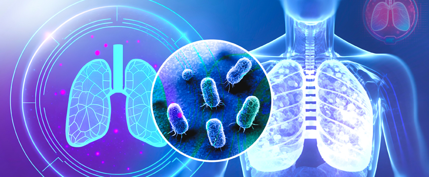

# Disease Detection System




## Table of Contents

1. [Business Understanding](#business-understanding)
   - [Overview](#overview)
   - [Goal](#goal)
   - [Objectives](#objectives)
   - [Stakeholders](#stakeholders)

2. [Data Understanding](#data-understanding)

3. [Data Preparation](#data-preparation)

4. [Modeling](#modeling)

5. [Conclusion](#conclusion)

6. [Recommendations](#recommendations)

7. [Next Steps](#next-steps)

8. [Deployment](#deployment)
   - [Installation](#installation)

9. [Libraries and Tools Used](#libraries-and-tools-used)

10. [License](#license)

11. [Contributing Members](#contributing-members)

12. [Contacts](#contacts)

13. [Repository Structure](#repository-structure)

## Business Understanding

**Overview**

Influenza and tuberculosis (TB) are significant respiratory diseases with high infection rates worldwide, posing serious public health challenges. Influenza spreads rapidly in seasonal outbreaks, while TB remains a top infectious killer, especially in densely populated areas. Our AI-driven detection system uses social media data to identify early signs of these diseases, enabling health agencies like WHO to detect potential outbreaks quickly. This proactive approach helps reduce disease transmission, improve response times, and ultimately lower morbidity and mortality rates globally.

**Goal**
Early detection of potential influenza and tuberculosis outbreaks using
real-time twitter data.
 

**Objectives**

1. Track the spread patterns of these diseases by monitoring symptom-related keywords
2. Develop predictive models to forecast the trajectory of potential outbreaks.
3. Provide early alerts to public health organizations and government agencies to enable faster response and intervention.

## Stakeholders
1. World Health Organization (WHO)
Global health agency responsible for coordinating pandemic preparedness and response

2. National/Regional Public Health Organizations
Disease control centers, epidemiology departments in countries/regions

3. Emergency Response Agencies
Disaster management authorities, emergency medical teams

4. Government Policymakers
Health ministers, legislators responsible for public health policies

5. Healthcare Providers
Hospitals, clinics, and other medical facilities that need early warning

6. Public Health Researchers and Epidemiologists
Academics and analysts studying disease trends and mitigation strategies

7. The General Public
Citizen stakeholders who benefit from faster outbreak response and containment

## Data Understanding

Data Sources
The data originates twitter.The data was scraped using `Twibot`
Below is the description of the column names
 
## Data Preparation

The data processing step involved analyzing and cleaning a merged dataset of tweets related to the  Flu and Tuberculosis Tweets originally composed of multiple CSV files. A DataUnderstanding class was created to examine the dataset revealing missing values and discrepancies as well as a large number of apparent duplicates most of which were false positives due to partial similarities.
 
 ## Modeling
In our model evaluation process, we tested both Random Forest and BiLSTM models, focusing on recall and accuracy to determine which model generalizes best to unseen data.

**Recall:**

The Random Forest model achieved the highest recall on the training set (1.0000) and a strong recall on the test set (0.8368). However, BiLSTM outperformed it on the test set with a recall of 0.9150, indicating better retention of true positives in unseen data.
BiLSTM also had excellent recall on the training set (0.9886) and demonstrated its robustness with a high recall score of 0.9150 on the test set.
Conclusion: BiLSTM had the best generalization in terms of recall on the test set.
**Accuracy:**

The Random Forest model achieved perfect accuracy on the training set (1.0000) and a high accuracy of 0.9823 on the test set.
BiLSTM performed slightly better, with an accuracy of 0.9984 on the training set and 0.9858 on the test set.
Conclusion: BiLSTM outperformed Random Forest slightly in terms of test set accuracy.
 

## Conclusion
Given both recall and accuracy metrics on the test set, the BiLSTM model stands out as the best-performing model. Its strong performance on the test set suggests better generalization, making it the most reliable choice for accurately predicting on new data.
  

## Recommendations
1. Track model performance metrics over time
2. Set up alerts for performance degradation
3. Regularly tune and retrain your machine learning models to maintain high accuracy, especially as new data trends emerge.

## Next steps
1. Incorporate Related Social Media Platforms: Expand data collection to other platforms (like Facebook or Instagram) if applicable. This broadens the dataset and captures a wider public sentiment.
2. Establish Partnerships with Health Agencies: Partner with health organizations that could benefit from timely disease information, enhancing the project's real-world impact.
3. Develop Clear Data Retention Policies: Define how long data will be stored, particularly sensitive information like location, to ensure ethical data handling.
4. Integrate Disease Forecasting Models: For longer-term insights, experiment with time-series forecasting models, such as ARIMA, Prophet, or LSTM, to predict future trends based on historical data.

 
### Deployment
Check out our app by clicking on this button [App Here](https://disease-csv-visual.vercel.app/)

### Installation 
To run the application locally, follow the following steps:

**Clone the repository**

**https:**
```
git clone https://github.com/AmaniWanene/Disease-Outbreak-Tracking.git
```
**ssh:**
```
git clone git@github.com:AmaniWanene/Disease-Outbreak-Tracking.git
```
**Navigate to the project directory**

```
cd Disease-Outbreak-Tracking.git
```
**Create a virtual environment**

```
python -m venv vader_env
```
**Activate the virtual environment**

**Windows:**
```
vader_env\Scripts\activate
```
**MacOS/Linux:**
```
source vader_env/bin/activate
```
**Install dependencies**
```
pip install -r requirements.txt
```
 

## 🔗 Libraries and Tools Used


## License
MIT License

## Contributing members
- [Faith Watene](https://github.com/faith-watene) 
- [Amani Wanene](https://github.com/AmaniWanene)
- [Evans Oyugi](https://github.com/EvansOyugi)
- [Catherine Wangui](https://github.com/Katekui2024)

  
## Contacts
- wanguufaith@gmail.com
- jangkatrina@gmail.com

Kindly don't hesitate to reach out to the team if you have any questions.

## Repository Structure

 ```
Disease-Outbreak-Tracking/
│
└── Deployment/public
    ├── .images
    ├── Models
    ├── data
    ├── Data Report.docx
    ├── LICENCE
    ├── README.md
    ├── diseases.ipynb
    ├── presentation.pdf
    ├── requirements.txt 
```


